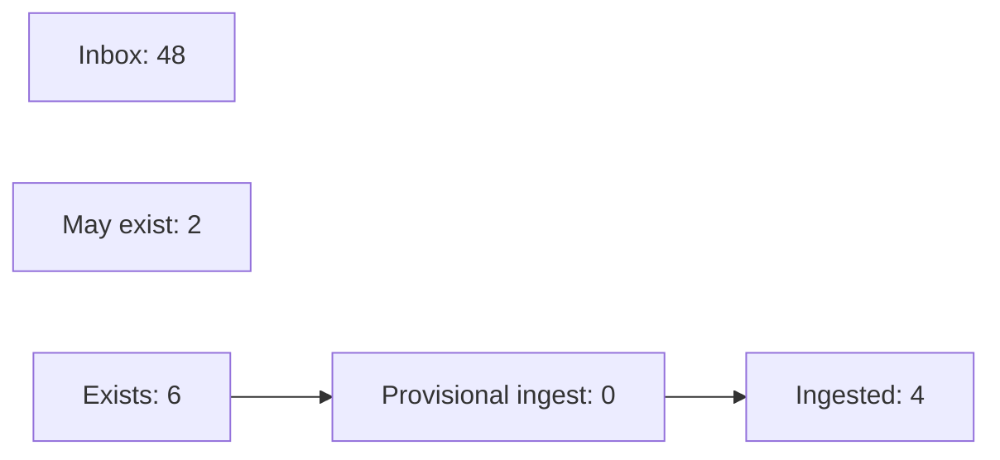
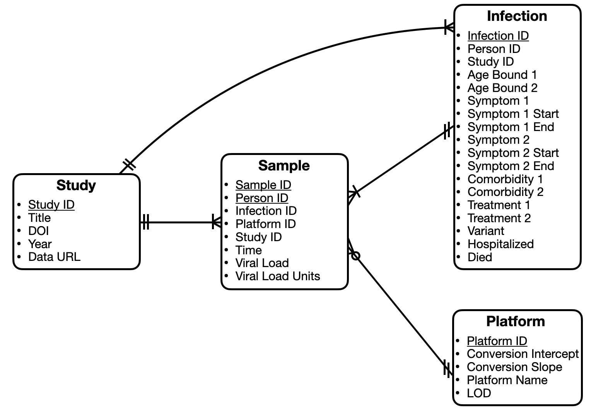

# Open Pathogen Kinetics Commons: the viral kinetics database

This repository contains software to combine data from multiple studies into a single viral kinetics database. 

## Quick start

### Virtual environment setup (once)
This project uses `venv` to manage package versions. After cloning this project to your local machine, navigate to the root directory (`OPKC/`) and run the following from the command line: 

`python3 -m venv venv`

Next, activate the virtual environment: 

`source venv/bin/activate`

Install all the required packages from the `requirements.txt` file: 

`pip install -r requirements.txt`

### Virtual environment management (every time you open the code) 

Be sure to re-activate the virtual environment: 

`source venv/bin/activate`

### Data processing 

To ingest the data, format it, and generate the database, run 

```
python3 -m ingest_studies.create_schema
```

A helper script for testing the ingestion of individual studies before integrating them into the full database is also available: 

```
python3 -m ingest_studies.test_import
```

## Phase I progress

### Ingesting studies 




## Phase II Work Plan

### Relational Database Structure 

Here's a provisional entity relationship diagram: 



### Web app architecture 

