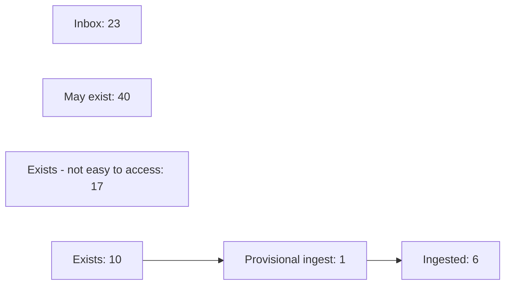
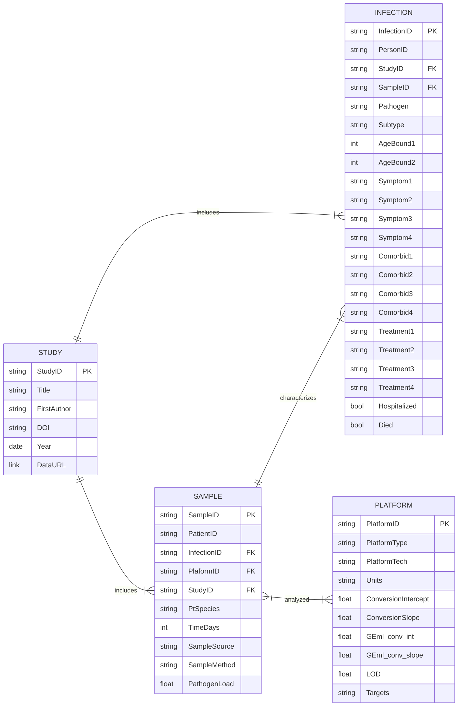

# Open Pathogen Kinetics Commons: the viral kinetics database

This repository contains software to combine data from multiple studies into a single viral kinetics database. 

## Quick start

### Virtual environment setup (once)
This project uses `venv` to manage package versions. After cloning this project to your local machine, navigate to the root directory (`OPKC/`) and run the following from the command line: 

`$ python3 -m venv venv`

Next, activate the virtual environment: 

`source venv/bin/activate`

Install all the required packages from the `requirements.txt` file: 

`pip install -r requirements.txt`

Last (important!!), add `venv/` and `.env` to your `.gitignore` file (create one in your local `gvkl/` directory if you don't have one yet) 

```
# .gitignore
venv/
.env
```

### Virtual environment management (every time you open the code) 

Be sure to re-activate the virtual environment: 

`source venv/bin/activate`

### Data processing 

To ingest the data, format it, and generate the database, run 

```
$ python3 code/ingest_studies/create_schema.py
```

A helper script for testing the ingestion of individual studies before integrating them into the full database is also available: 

```
$ python3 code/ingest_studies/test_import.py
```

## Phase I progress

### Ingesting studies 


```mermaid
graph LR
	inbox[Inbox: 23]
	mayexist[May exist: 40]
	denea[Exists - not easy to access: 17]
	exists[Exists: 10]
	provingest[Provisional ingest: 1]
	ingested[Ingested: 6]
	exists --> provingest --> ingested
```

### Schema

#### Fields and definitions
- StudyID: A unique identifier for the study from which the data comes
- PatientID: A unique person/patient/individual identifier
- Pathogen: ["SARS2", "Flu", "Dengue", "WestNile"]
    - Prefer shortest cleanest, high-level term
    - Keep track of naming quirks here for consistency
- PtSpecies: "Patient species" e.g. human, mosquito - the patient sampled in the particular study (not asking anything about possible vectors)
    - Use naming convention per the paper or simple common name, rather than scientific names
- InfectionID: A unique infection identifier (in case multiple infections in a single person, as needed)
- SampleID: An identifier for the biological sample
- TimeDays: Time in days since the infection's "time 0"
    - or, for challenge studies, time since inoculation
- Symptoms1: Symptom ICD code 1 OR granular symptomatic vs. asymptomatic data depending on the original study's level of detail
- Symptoms2: Symptom ICD code 2
- Symptoms3: Symptom ICD code 3
- Symptoms4: Symptom ICD code 4
- Comorbidity1: Comorbidity ICD code 1
- Comorbidity2: Comorbidity ICD code 2
- Comorbidity3: Comorbidity ICD code 3
- Comorbidity4: Comorbidity ICD code 4
- Treatment1: CPT code of treatment 1
- Treatment2: CPT code of treatment 2
- Treatment3: CPT code of treatment 3
- Treatment4: CPT code of treatment 4
- Hospitalized: Was the patient hospitalized?
- SampleSource: Anatomical source of sample (e.g., saliva, nose/anterior nares, nasopharyngeal), formerly SampleType - e.g. the thing in the tube that goes in analysis machine
	-Note: NP = nasopharyngeal, OP = oropharyngeal, MT = mid-turbinate, AN = anterior nares (all these are different! NP is most invasive, AN is least)
	- reasonable to say nose = anterior nares and throat = OP, but better to use study terminology than to rename
- SampleMethod: Type of sample, medium if relevant (e.g., swab, raw saliva, buffered saliva, VTM)
- AgeRng1: Lower end of the patient's age bracket
- AgeRng2: Upper end of the patient's age bracket
- Subtype: Pathogen subtype/strain/variant
- PlatformType: Analytical test platform type (e.g. RT-qPCR, plaque-forming assay, antibody titer)
- DOI: DOI of the study or data repository
- PathogenLoad: Viral load or other pathogen concentration measurement (most commonly will be log10 viral load - but need to specify!)
- Units: Viral load units (e.g., Ct, GE/ml)
- GEml_conversion_intercept: Conversion intercept from viral load units to - GE/ml
- GEml_conversion_slope: Conversion slope from viral load units to GE/ml
- Targets: Platform target(s) e.g. amplification of N1 gene (comma-separated string, not a list)
- PlatformTech: Analytical test platform manufacturer or machine info (e.g. Roche cobas, Taqpath, BioRad CFX Maestro)

#### ID Assignments

TBD

##### StudyID

For v1: firstauthorYear

##### PersonID

For v1: from study

##### InfectionID

Leave blank/TBD

##### SampleID

Leave blank/TBD or from study

## Phase II Work Plan

### Relational Database Structure 

Entity Relationship Diagram


```mermaid
erDiagram
    direction LR
    STUDY ||--|{ SAMPLE : includes
    STUDY ||--|{ INFECTION : includes
    SAMPLE ||--|{ INFECTION : characterizes
    SAMPLE }|--|{ PLATFORM : analyzed
    STUDY {
        string StudyID PK
        string Title
        string FirstAuthor
        string DOI
        date Year
        link DataURL
    }
    SAMPLE {
        string SampleID PK
        string PatientID
        string InfectionID FK
        string PlaformID FK
        string StudyID FK
        string PtSpecies
        int TimeDays
        string SampleSource
        string SampleMethod
        float PathogenLoad
    }
    INFECTION {
        string InfectionID PK
        string PersonID
        string StudyID FK
        string SampleID FK
        string Pathogen
        string Subtype
        int AgeBound1
        int AgeBound2
        string Symptom1
        string Symptom2
        string Symptom3
        string Symptom4
        string Comorbid1
        string Comorbid2
        string Comorbid3
        string Comorbid4
        string Treatment1
        string Treatment2
        string Treatment3
        string Treatment4
        bool Hospitalized
        bool Died
    }
    PLATFORM {
        string PlatformID PK
		string PlatformType
		string PlatformTech
        string Units
        float ConversionIntercept
        float ConversionSlope
        float GEml_conv_int
        float GEml_conv_slope
        float LOD
        string Targets
    }
```

<!--
Here's a provisional entity relationship diagram: 

-->

### Web app architecture 

