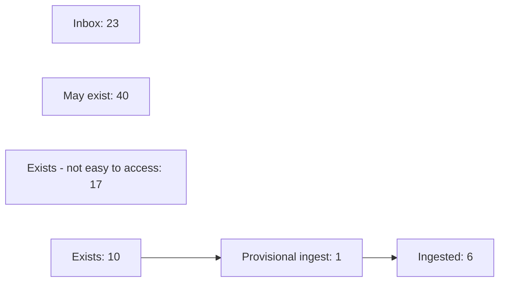
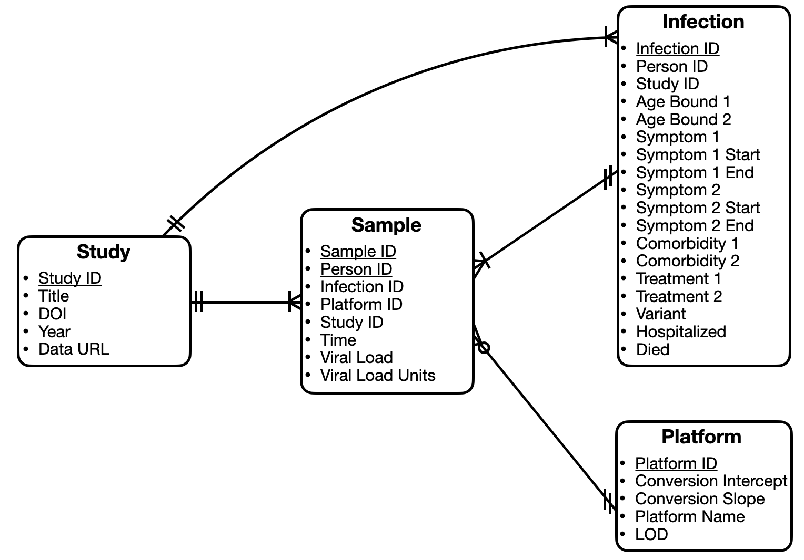

# Open Pathogen Kinetics Commons: the viral kinetics database

This repository contains software to combine data from multiple studies into a single viral kinetics database. 

## Quick start

### Virtual environment setup (once)
This project uses `venv` to manage package versions. After cloning this project to your local machine, navigate to the root directory (`OPKC/`) and run the following from the command line: 

`$ python3 -m venv venv`

Next, activate the virtual environment: 

`source venv/bin/activate`

Install all the required packages from the `requirements.txt` file: 

`pip install -r requirements.txt`

Last (important!!), add `venv/` and `.env` to your `.gitignore` file (create one in your local `gvkl/` directory if you don't have one yet) 

```
# .gitignore
venv/
.env
```

### Virtual environment management (every time you open the code) 

Be sure to re-activate the virtual environment: 

`source venv/bin/activate`

### Data processing 

To ingest the data, format it, and generate the database, run 

```
$ python3 code/ingest_studies/create_schema.py
```

A helper script for testing the ingestion of individual studies before integrating them into the full database is also available: 

```
$ python3 code/ingest_studies/test_import.py
```

## Phase I progress

### Ingesting studies 


```mermaid
graph LR
	inbox[Inbox: 23]
	mayexist[May exist: 40]
	denea[Exists - not easy to access: 17]
	exists[Exists: 10]
	provingest[Provisional ingest: 1]
	ingested[Ingested: 6]
	exists --> provingest --> ingested
```

### Schema

- StudyID: A unique identifier for the study from which the data comes
- PersonID: A unique person identifier
- Pathogen: ["SARS2", "Flu", "Dengue", "WestNile"]
- PtSpecies: "Patient species" e.g. human, mosquito - the patient sampled in the particular study (not asking anything about possible vectors)
- InfectionID: A unique infection identifier (in case multiple infections in a single person)
- SampleID: An identifier for the biological sample
- TimeDays: Time in days since the infection's "time 0"
- Symptoms1: Symptom ICD code 1
- Symptoms2: Symptom ICD code 2
- Symptoms3: Symptom ICD code 3
- Symptoms4: Symptom ICD code 4
- Comorbidity1: Comorbidity ICD code 1
- Comorbidity2: Comorbidity ICD code 2
- Comorbidity3: Comorbidity ICD code 3
- Comorbidity4: Comorbidity ICD code 4
- Treatment1: CPT code of treatment 1
- Treatment2: CPT code of treatment 2
- Treatment3: CPT code of treatment 3
- Treatment4: CPT code of treatment 4
- Hospitalized: Was the patient hospitalized?
- SampleSource1: Anatomical source of sample (e.g., saliva, nose/anterior nares, nasopharyngeal), formerly SampleType
- SampleSource2: as above
- SampleMethod: Type of sample, medium if relevant (e.g., swab, raw saliva, buffered saliva, VTM)
- AgeRng1: Lower end of the patient's age bracket
- AgeRng2: Upper end of the patient's age bracket
- Subtype: Pathogen subtype/strain/variant
- Platform: Analytical test platform (e.g. RT-qPCR, plaque-forming assay, antibody titer)
- DOI: DOI of the study or data repository
- VL: log10 Viral load
- Units: Viral load units (e.g., Ct, GE/ml)
- GEml_conversion_intercept: Conversion intercept from viral load units to - GE/ml
- GEml_conversion_slope: Conversion slope from viral load units to GE/ml
- Target1: Platform target e.g. amplification of N1 gene
- Target2: as above

## Phase II Work Plan

### Relational Database Structure 

Here's a provisional entity relationship diagram: 



### Web app architecture 

